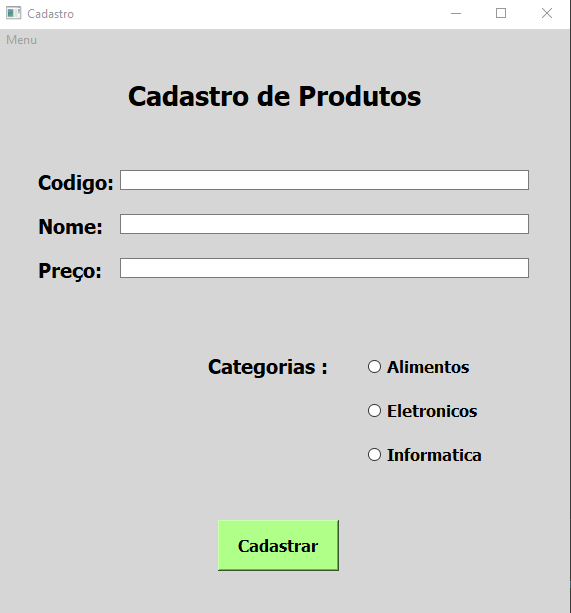
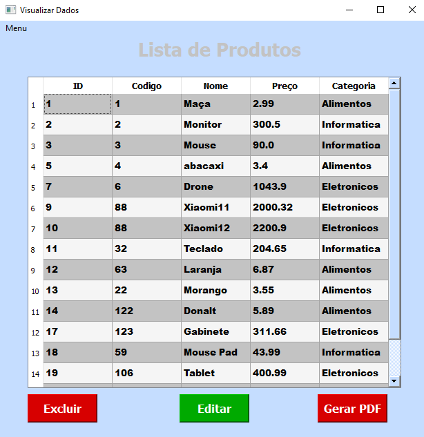
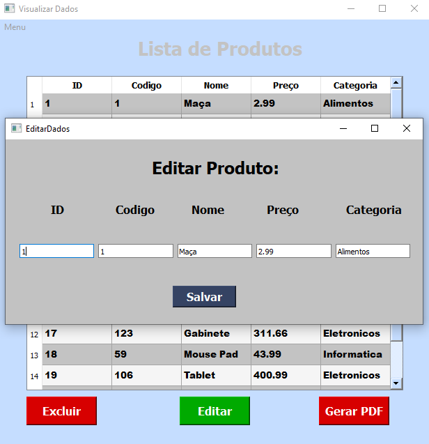

<h1 align="center">Cadastro De Produtos<h1>
  
  <h3>Programa com interface gráfica para cadastrar produtos em uma Base de dados.<h3>
    
  <h3>Desenvolvido com PyQt5 e Mysql.<h3>
    
  <h4>Cadastro de Produtos.<h4>
    
  
   
  <h4>Visualizar Base de Dados.<h4>
    
  
  
       
  <h4>Editar Produtos da Base de Dados.<h4>

  
